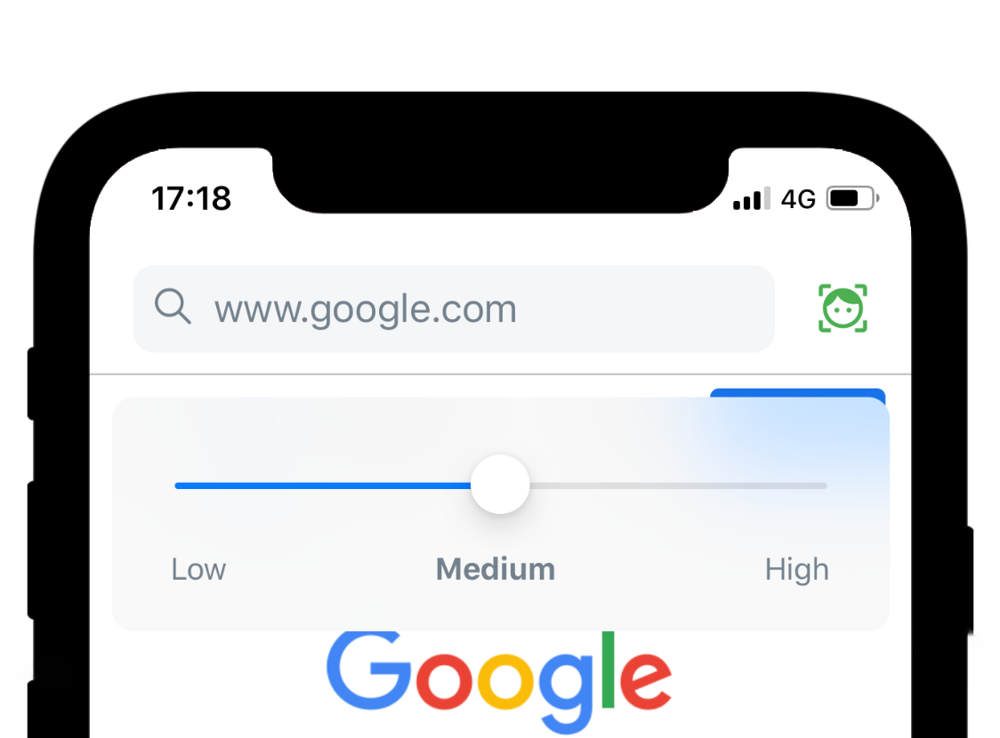

<p align="center">
    <a aria-label="expo" href="https://expo.io/" target="_blank">
        
    </a>   
    <a aria-label="build" href="https://github.com/WeixuanZ/wink/actions" target="_blank">
      
    </a>
    <a aria-label="version" href="https://github.com/WeixuanZ/wink/blob/master/CHANGELOG.md">
      
    </a>
    <a aria-label="licensed" href="https://github.com/WeixuanZ/wink/blob/master/LICENSE" target="_blank">
      
    </a>
</p>

---

Wink (・ω<) is a React Native app developed for a friend, who suffered from De Quervain Tenosynovitis. It enables you to scroll by winking 😉.

<p align="center">
  
</p>

This app is not designed to be fully touch-free, but to reduce the amount of scrolling required when browsing those infinitely long social media feeds. If you have an Apple device with True Depth Camera, using ARKit for eye-tracking (e.g. the amazing _Hawkeye Access_) could be a more appealing solution.

## Installation

If you are an Android user, you can use Wink through Expo Go, simply go to https://expo.io/@weixuanz/wink. Alternatively, you can install using APK from the [latest release](https://github.com/WeixuanZ/wink/releases/latest).

Things are more complicated if you are using iOS, since I haven't paid for the Apple Developer Program 🤦‍♂️. Currently, you can clone this repository and use expo-cli to serve locally.

```
yarn install
yarn run start
```

Or you can detach to plain ReactNative with `yarn run eject`, build using Xcode and sideload it onto your device. I may explore this option (e.g. provide .ipa file so you can install with [AltStore](https://github.com/rileytestut/AltStore)) when the app is in a more completed state.

## How to use 👀

Close right eye to scroll down and left to scroll up, keep it closed for continuous scrolling. Double blink to focus the search bar. Otherwise, it's just your usual browser.

You can turn blink detection off by pressing the face icon in the tool bar.

<p align="center">
  
</p>

Adjust wink detection sensitivity by long pressing the face icon.

<p align="center">
  
</p>

You can add or remove bookmarks by clicking the bookmark button in the navigation bar, whose state shows whether the current url is already bookmarked. The bookmarks are stored on device, and appear as a list when the search bar is focused.

<p align="center">
  
</p>

## License

MIT © [Weixuan Zhang](https://weixuanz.github.io/about/).
